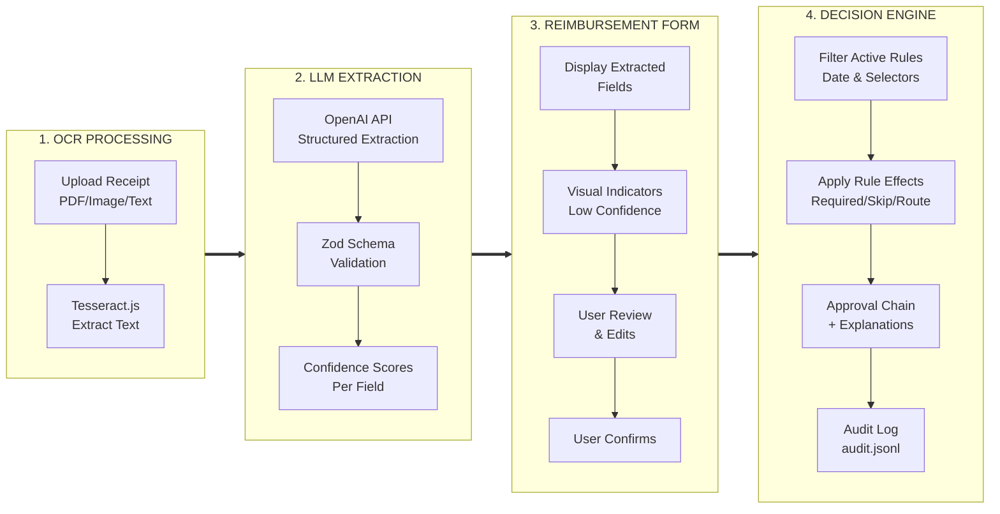

# Expense Reimbursement Conversational Agent: Exercise

## Analysis of Requirements

On one hand, there is a requirement to build a conversational agent for the analysis of taxi receipts from uber/lyft. On the other hand, there is an invitation to design a reliable and flexible system for submitting expense reimbursements.

**The core and most important requirement:** Make sure that submitted data trigger the appropriate rule(s).

**Reasonable requirement:** Get the country of the expense from the receipt.

**Unreasonable requirements:** Derive department and purpose of visit from an Uber/Lyft receipt. This is impossible.

**Dangerous requirement:** The invitation is to design an agent, which suggests that an LLM would drive the conversation and enforce the rules. However, LLMs are inherently nondeterministic. Relying on them to make financial decisions is risky at this stage. Reimbursement rules are deterministic and must be applied deterministically.

In addition, submitting financial data requires careful review and reevaluation of the entered information. Even when using a guided wizard, users often need to move back and forth between steps. Agentic chat technology is therefore not well-suited for this use case.

**Implicit and very important requirements:**
- US Office, EU Office, and Asia-Pacific Office use different currencies.
- The rules of the offices are expressed in their specific currencies.
- There are examples of departmental expenses that have nothing to do with Uber/Lyft receipts, such as detailed categorization and approval of IT expenses.

**The key goal:** Develop a software solution that significantly reduces human error in the expense reimbursement process. The system should be flexible and open to the addition of new rules. No hardcoded rules. The system should reasonably leverage LLM capabilities. It seems that Uber receipt submission is just a backdrop.

## Assumptions for the demo app

US Office uses USD.
EU Office uses Euro.
Asia-Pacific Office uses Indian Rupees.
Every department requires submissions in their specific currencies.

These assumptions are deduced from the fact that each department defines rules using regional currency.

## Architectural Choices

Financial and business decisions are based on rigid rules. We need to support deterministic rules; the rules should be extensible and ideally stored in a database. For demo purposes we will use JSON-based rules stored locally. We will add a linting script to verify the correctness of the rules.

We need to ensure that submitted reimbursement requests include all information to correctly trigger specific rules. This key information is the regional office that defines the relevant rules. The other fields are department and type of expense.

To trigger rules we need to supply information in structured form.

We will use OCR to extract text from the receipt. It will be plain text.

We will use an LLM to convert the text extracted from the receipt into a clean structured form, so that we can supply it to the rule engine that triggers routing of the expense.

We will use the structured information extracted by the LLM to prefill most fields on expense reimbursement forms.

Some fields like department cannot be derived from a taxi receipt. They will have to be filled manually. Some fields like regional office can be deduced from the country of expense, but they still have to be verified by the user because the expense may happen abroad.

We will make the form editable, which allows re-itemizing the expense as necessary or converting figures to different currencies manually.

**Evolution of Clarification Approach:** The initial design proposed using a conversational interface with 2-3 targeted clarification questions to resolve ambiguous fields. This evolved into a more user-friendly approach: an editable Expense Reimbursement Form presented at the review stage, with on-screen notices and visual indicators (confidence badges, highlights) flagging specific sections that need human attention. This allows users to see the complete context and make corrections in a single comprehensive view rather than answering sequential questions.

## Edge Cases

- An employee from a U.S. regional office travels to an EU country. The taxi receipt is issued in euros, but the expenses must be submitted in U.S. dollars.

- An employee receives a receipt itemized in a vendor-specific format, but the department requires a department-specific breakdown.

To handle these cases, we support an editable reimbursement form. The UI also prevents submitting a reimbursement request in a currency different from the required currency of the regional office.

**Out of scope for this demo:** 
- Automatic currency conversion would be a better solution than preventing user to submit reimbursement request in differnt currency
- Examples of rules that trigger department specific itemization

## Application Execution Flow

The flow demonstrates the key principle: **LLMs extract and suggest; deterministic rules decide.**

## Implementation Overview

### Technology Stack
- **Framework**: Next.js 15 (App Router) with TypeScript
- **Styling**: Tailwind CSS v4
- **Validation**: Zod for runtime schema validation
- **LLM Provider**: OpenAI API (server-side only)
- **OCR**: Tesseract.js for text extraction from images
- **PDF Processing**: PDF.js (pdfjs-dist) for PDF parsing

### Policy Management
- **Storage**: File-backed JSON rules in `policies/` directory
- **Versioning**: Effective date ranges (`effective_from`, `effective_to`) enable temporal rule changes
- **Evaluation**: Deterministic rule engine in `lib/evaluate.ts` with fixed approval step ordering
- **Policy Explorer**: `/policies` page with view modes (Active/Inactive/All) and on-demand LLM analysis
- **Quality Assurance**:
  - `npm run policy:lint` - Static validation of policy JSON structure
  - `npm run policy:eval` - Standalone policy evaluation script
  - `/api/policy-eval` - On-demand LLM-powered policy gap analysis with configurable models

### API Endpoints
- **`POST /api/extract`** - Accepts receipt image/text, returns structured extraction with confidence scores
- **`POST /api/submit`** - Evaluates expense against active rules, returns approval chain + audit entry
- **`GET /api/policies`** - Returns merged active policies for a given date (read-only)
- **`POST /api/policy-eval`** - Accepts `{policies, modelOverride?}`, returns analysis with conflicts, gaps, and test results

### LLM Usage Philosophy
The system uses LLMs for **extraction and assistance only**, never for business decisions:
- **Extraction**: Convert unstructured receipts into structured data (via `extraction.schema.ts`)
- **Confidence Scoring**: Per-field confidence to guide user attention
- **Explanations**: Generate human-readable rationale for decisions (post-evaluation)
- **Policy QA** (dev-only): Suggest test cases and identify rule conflicts

**Critical**: All approval routing decisions are made by deterministic rules in `lib/evaluate.ts`, not by LLMs.

### Data & Storage
- **No Database**: Demo application uses file-based storage only
- **Audit Trail**: Append-only `data/audit.jsonl` logs all submissions (demo purposes; ephemeral in serverless)
- **Policies**: JSON files version-controlled in `/policies`

### Evaluation Scripts
- **`npm run eval:taxi`** - Runs end-to-end evaluation on taxi receipt fixtures with ground truth comparison
- **`npm run policy:lint`** - Validates policy JSON syntax, date ranges, and selector consistency
- **`npm run policy:eval`** - Generates policy quality report with LLM-detected issues

### Key Files & Modules
| Path | Purpose |
|------|---------|
| `lib/evaluate.ts` | Deterministic rule engine (filters, applies, orders approval steps) |
| `lib/extractionLLM.ts` | OpenAI API wrapper for structured extraction |
| `lib/policyLoader.ts` | Loads and validates policy JSON files |
| `schemas/extraction.schema.ts` | Zod schema defining receipt extraction contract |
| `schemas/policy.schema.ts` | Zod schema defining policy DSL structure |
| `scripts/evalTaxiReceipts.ts` | End-to-end evaluation harness with OCR + ground truth |

---

**For complete technical specification, API contracts, type definitions, and detailed flows, see [SPEC.md](SPEC.md).**
