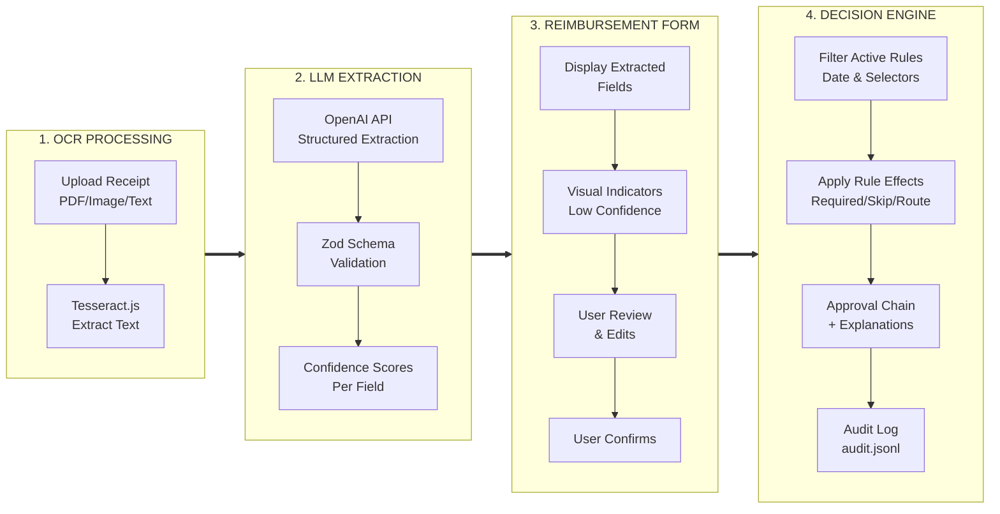

# Expense Reimbursement Conversational Agent (Next.js, File‑Backed)

## Executive Summary

Goal: Reduce submission errors caused by complex, changing expense rules by combining a deterministic rules engine with LLM‑assisted extraction and guardrails.
Demo scope: Upload a ride‑hailing receipt (Uber/Lyft), extract fields, ask targeted questions when ambiguous, evaluate date‑effective rules (including a threshold change from $50 to $75), and render an explainable approval chain.
Rules storage: JSON files in /policies.
LLM usage:

Runtime (Variant 1): Structured extraction + minimal clarifying question generation + narrative explanation.

Dev QA (Variant 2): LLM “policy eval” that critiques policy JSON and generates adversarial tests—does not decide approvals.

Non‑goals (for the demo): No database, no background jobs, no currency conversion (see assumptions), limited receipt types (Uber/Lyft).

## Objectives & Success Criteria
### Product Objectives

Cut human error during expense submissions (wrong country, wrong department, wrong approval chain).

Explain decisions with rule IDs and rationale to build user trust.

Handle rule changes over time (effective dates) without breaking existing logic.

### Measurable Success (file‑logged)

Low-confidence fields per submission: median ≤ 2 fields requiring attention (on fixture set). **Note:** Evolved from "clarifications per submission" as the implementation moved from sequential Q&A to form-based review with visual indicators.

Misroute rate (wrong approval chain) on fixtures: ≤ 2% after guardrails.

Policy QA: LLM eval report flags ≥ 1 real conflict/overlap when injected.

## Scope & Assumptions
### In Scope

Receipt types: Uber/Lyft email or PDF/text (for demo: image/PDF upload or pasted text).

Regions: US, EU, APAC (sample overlays).

Departments: Engineering, Sales, HR (affects routing).

Categories: ride_hail (primary), plus travel, meals, software for APAC example.

Rules: Global manager skip threshold changes from 50 → 75 (post new rule date), plus regional overlays.

### Out of Scope (MVP)

FX conversion (see 2.3 assumption).

SSO, RBAC beyond “employee” vs “admin view”.

Email ingestion pipeline.

### Key Assumptions

Currency: For the demo, thresholds are defined in the region’s local currency to avoid FX.

US rules use USD; EU rules use EUR.

APAC examples can use USD or a demo local currency; we will keep amounts consistent with the examples.

Rule precedence: More specific selectors override generic; require‑step dominates skip‑step.

Server environment: Node runtime with write access only in local dev. In hosted serverless, writes to disk are ephemeral—so the “audit log” is demo‑only.

## User Stories

As an employee, I upload a ride‑hailing receipt and get the correct approval chain with a clear explanation.

As an employee, if the system is unsure (country/department), it asks me a single, crisp question to resolve ambiguity.

As a finance admin (demo), I can view current policies (read‑only), see rule hits, and view an audit trail.

As a developer, I can run policy QA to detect overlapping rules or missing edge cases before shipping.

## System Architecture (Next.js only)

### Execution Flow



### Architecture Diagram (logical)
[Browser UI (Next.js + Tailwind)]
  │
  ├─ /api/receipts (upload/parse stub)
  ├─ /api/extract  ──► LLM (structured JSON)
  ├─ /api/submit   ──► Deterministic Rule Evaluator ──► Decision (chain + rationale)
  ├─ /api/policies (read file-backed JSON)
  └─ /api/policy-eval (LLM QA: warnings, conflicts, gaps, optional suggested tests)
            │
       [/policies/*.json] (rules as data)
            │
       [/data/audit.jsonl] (append-only demo log)

### Stack

Next.js (App Router) + TypeScript

Tailwind CSS (v4)

Zod for schema validation

Node fs for reading /policies and writing /data/audit.jsonl

OpenAI API for LLM (via openai package, server‑side only)

Tesseract.js for OCR text extraction

PDF.js (pdfjs-dist) for PDF parsing

tsx for running TypeScript scripts directly

## File & Module Layout
```text
/app
  /(routes)
    /home
      /upload/page.tsx         # Upload or paste receipt text (wizard step 1)
      /review/page.tsx         # Show extracted fields + clarifications (wizard step 2)
      /review/review-client.tsx # Client component for review page
      /decision/page.tsx       # Final approval chain + rationale (wizard step 3)
      /decision/decision-client.tsx # Client component for decision page
      /layout.tsx              # Wizard layout with WizardNav
      /page.tsx                # Redirects to /home/upload
    /upload/page.tsx           # Compat redirect to /home/upload
    /review/page.tsx           # Compat redirect to /home/review
    /decision/page.tsx         # Compat redirect to /home/decision
    /policies/page.tsx         # Policy Explorer: Active/Inactive/All view with LLM analysis
    /policies/policies-client.tsx # Client component with view selector and analysis UI
  /api
    receipts/route.ts          # (optional) upload stub; for demo supports text
    extract/route.ts           # calls LLM to extract fields + confidences
    submit/route.ts            # deterministic evaluation + audit write
    policies/route.ts          # returns merged policies (read-only)
    policy-eval/route.ts       # accepts policies array, returns LLM analysis (no test execution)
/components
  ArtifactPreview.tsx          # Preview for uploaded receipts (OCR/PDF)
  ReceiptPreview.tsx           # Receipt display component
  FieldEditor.tsx              # Generic field editing component
  DateTimeEditor.tsx           # Date/time field editor
  LineItemsEditor.tsx          # Editor for itemized line items
  ItemizedBreakdown.tsx        # Display itemized breakdown
  ClarifierChat.tsx            # Clarification questions UI
  ApprovalStepper.tsx          # Approval chain stepper visualization
  RuleHitList.tsx              # Display rule hits and explanations
  ConfidenceBadge.tsx          # Confidence score badge
  WizardNav.tsx                # Wizard navigation component
/lib
  evaluate.ts                  # deterministic rule engine
  policyLoader.ts              # loads + validates /policies/*.json
  clarifications.ts            # compute minimal question set
  explain.ts                   # narrative explanation from rule hits
  extractionLLM.ts             # LLM extraction logic
  openaiClient.ts              # OpenAI client wrapper
  region.ts                    # region mapping utilities
  categories.ts                # category loading and utilities
  policyQA.ts                  # LLM-based policy QA
  audit.ts                     # audit logging utilities
  types.ts                     # shared TS types
/schemas
  extraction.schema.ts         # zod schema for LLM extraction JSON
  policy.schema.ts             # zod schema for policy DSL
  policyEval.schema.ts         # zod schema for LLM policy QA output
/policies
  global.v1.json               # pre-change baseline rules
  global.v2.json               # post-change baseline rules
  region.us.json
  region.eu.json
  region.apac.json
  categories.json              # enum & labels (read-only)
/scripts
  policyLint.mjs               # deterministic static lints
  policyEval.mjs               # calls /api/policy-eval or provider directly
  evalTaxiReceipts.ts          # OCR + LLM evaluation harness covering taxi datasets
  utils/
    ocr.ts                     # OCR utilities (Tesseract.js + PDF.js)
    groundTruth.ts             # ground-truth loader and country mapping
  datasets/
    taxi_ground_truth.csv      # ground truth data for taxi receipts
    taxi_pdfs/                 # fixture PDFs for evaluation
/data
  audit.jsonl                  # append-only demo telemetry
README.md
SPEC.md
AGENTS.md                      # Agent configuration documentation
```

## Runtime Guardrails
### Extraction → Clarification → Decision

Extraction (OCR + LLM): Tesseract.js processes uploaded receipts, capturing token‑level text and confidences. The normalized OCR output flows into the LLM, which maps the document onto the Extraction schema and returns field‑level confidence scores alongside the structured JSON. Fields that rarely appear on receipts (e.g., department, expense category, trip purpose) rely on heuristics such as user-profile defaults or vendor templates rather than direct OCR hits; these start with intentionally conservative confidence scores.

Clarification (evolved approach): **Note:** The initial design proposed asking 1-2 targeted multiple-choice questions in a chat-like interface. This evolved into a more comprehensive approach: the review page presents an editable Expense Reimbursement Form with all extracted fields. Visual indicators (badges, highlights, or notices) flag fields that need human attention—either because confidence scores are below threshold or because the field relies on inference rather than direct OCR. Users can review and edit any field before proceeding, resolving all potential ambiguities in a single form rather than through sequential clarification questions.

Decision (deterministic): Load active rules (by date/region/category), compute approval steps, and render rationale.

### Confidence Thresholds

amount: ≥ 0.95 (numeric OCR values must be high confidence to avoid re-entry.)

currency: ≥ 0.95 (symbol + text agreement; sub-threshold triggers manual confirmation.)

dateISO: ≥ 0.90 (dates close to boundaries prompt confirmation.)

country: ≥ 0.80 (geo inferred from receipt metadata; under-threshold evokes question.)

category: start at ≤ 0.70 when inferred from vendor template; require explicit user confirmation before submit unless user overrides.

department|purpose: default to user profile (confidence ≤ 0.60) or remain empty; treat as required manual input if not confirmed.

### Clarification Approach (implementation note)

**As Implemented:** Instead of sequential clarification questions, the review form presents all fields simultaneously with visual cues. Low-confidence fields are marked with ConfidenceBadge components and warning notices directing user attention. Editable dropdowns and text inputs allow users to confirm or override any extracted value. This approach reduces friction and allows users to review the entire expense context before making corrections.

**Original Design (for reference):** The initial specification proposed targeted multiple-choice questions:
- Country: "Which country was this ride in?" ['US','Germany','France','UK','Other']
- Department: "Which department should we charge this to?" [Engineering, Sales, HR, Other]
- Purpose: "Primary purpose?" [Client Meeting, Office Commute, Airport Transfer, Other]

### Deterministic Step Ordering

Final chain ordered as: ["compliance","hr","it","manager","finance"]
(Only included if required by rules; manager can be skipped by threshold; finance is included by default unless rules say otherwise.)

## Policy DSL (JSON, file‑backed)
### Schema (informal)
```typescript
type Money = { amount: number; currency: string }; // ISO 4217 uppercase
type Selectors = Partial<{
  region: "US"|"EU"|"APAC";
  department: "engineering"|"sales"|"hr"|"other";
  category: "ride_hail"|"travel"|"meals"|"software";
}>;

type Rule = {
  id: string;                // unique
  name: string;
  priority: number;          // lower number = earlier
  effective_from: string;    // ISO datetime UTC
  effective_to?: string;     // open ended if absent
  selectors: Selectors;      // matchable fields (exact)
  effect: {
    always_require_steps?: string[]; // e.g., ["finance"]
    require_steps_if?: Array<{
      when: { amount_gt?: Money };   // other predicates can be added
      steps: string[];
    }>;
    skip_steps_below?: Array<{
      step: "manager"|"hr"|"it"|"compliance"|"finance";
      amount: number;
      currency: string;
    }>;
    category_routes?: Record<string, string[]>; // category -> steps
  };
  comment?: string;          // ignored by evaluator; used by QA
};
```

### Rule Precedence

Executive Exceptions (not in MVP, but reserved).

Region + Department + Category

Region + Category / Department + Category

Region / Department

Global baseline

Conflict resolution:

Any rule that requires a step overrides another that would skip it.

For skip_steps_below on the same step, choose the largest threshold among matching rules (most permissive), unless a conflicting require exists.

## Example Policies
### Global Manager Threshold (pre/post change)
```json
[
  {
    "id": "global-manager-threshold-v1-us",
    "name": "Global manager skip < $50 (pre-change, US)",
    "priority": 10,
    "effective_from": "1900-01-01T00:00:00Z",
    "effective_to": "2024-09-30T23:59:59Z",
    "selectors": { "category": "ride_hail", "region": "US" },
    "effect": { "skip_steps_below": [{ "step": "manager", "amount": 50, "currency": "USD" }] }
  },
  {
    "id": "global-manager-threshold-v2-us",
    "name": "Global manager skip < $75 (post-change, US)",
    "priority": 10,
    "effective_from": "2024-10-01T00:00:00Z",
    "selectors": { "category": "ride_hail", "region": "US" },
    "effect": { "skip_steps_below": [{ "step": "manager", "amount": 75, "currency": "USD" }] }
  }
]

```

Assumption for demo: mirror this pattern for EU using EUR (same numeric thresholds) to avoid FX.

### US Regional Overlay
```json
{
  "id": "us-autoapprove-under-100",
  "name": "US auto-approve (skip manager) < $100",
  "priority": 20,
  "selectors": { "region": "US", "category": "ride_hail" },
  "effect": { "skip_steps_below": [{ "step": "manager", "amount": 100, "currency": "USD" }] },
  "comment": "More permissive than global; manager skipped under $100."
}

```

### EU Compliance and HR
```json
[
  {
    "id": "eu-compliance-over-50",
    "name": "EU compliance > €50",
    "priority": 20,
    "selectors": { "region": "EU" },
    "effect": {
      "require_steps_if": [
        { "when": { "amount_gt": { "amount": 50, "currency": "EUR" }}, "steps": ["compliance"] }
      ]
    }
  },
  {
    "id": "eu-travel-needs-hr",
    "name": "EU travel requires HR",
    "priority": 20,
    "selectors": { "region": "EU", "category": "travel" },
    "effect": { "always_require_steps": ["hr"] }
  }
]

```

### APAC Category Routing
```json
{
  "id": "apac-category-routing",
  "name": "APAC category-based routing",
  "priority": 20,
  "selectors": { "region": "APAC" },
  "effect": {
    "category_routes": {
      "meals": ["manager"],
      "travel": ["finance"],
      "software": ["it"]
    }
  }
}

```

## Deterministic Rule Evaluator (spec)
### Inputs
```typescript
type Expense = {
  dateISO: string;                 // expense date
  region: "US"|"EU"|"APAC";
  department?: "engineering"|"sales"|"hr"|"other";
  category: "ride_hail"|"travel"|"meals"|"software";
  total: { amount: number; currency: string };
};

```

### Algorithm

Activate rules where effective_from ≤ date ≤ effective_to? and all non‑empty selectors match the expense.

Sort active rules by priority ASC.

Accumulate:

requiredSteps (Set) from always_require_steps and satisfied require_steps_if.

routedSteps (Set) from category_routes[category].

skipThresholdsByStep (Map step → max Money). Only considered if the expense currency matches the threshold currency.

Build base chain:

Include routedSteps ∪ requiredSteps.

Include finance by default (unless some rule explicitly excludes it—not in MVP).

Include manager by default (subject to skip logic).

Skip logic: If step ∈ base and step has a skip threshold satisfied and step ∉ requiredSteps, remove the step.

Order final steps as ["compliance","hr","it","manager","finance"].

Output { steps, skipped: string[], ruleHits: {ruleId, reason}[] }.

### Edge Rules

If multiple skip thresholds exist for the same step, use the largest amount among matches.

If a required step conflicts with a skip instruction, keep the step.

## LLM Usage (bounded)
### Runtime Extraction (Variant 1)

Input: OCR text or pasted text; vendor hint; optional user profile hints.

Output (must match Zod schema):

```typescript
// /schemas/extraction.schema.ts
import { z } from "zod";

export const LineItemSchema = z.object({
  label: z.string().min(1),
  amount: z.number(),
  currency: z.string().length(3).optional(), // defaults to parent currency if omitted
});

const ExtractionSchemaBase = z.object({
  amount: z.number().positive(),
  currency: z.string().length(3),
  dateISO: z.string().datetime(),
  // Vendor can be any taxi/ride-hailing provider name as printed
  vendor: z.string().min(1),
  country: z
    .string()
    .min(1)
    .describe(
      "Country where the ride occurred; derive from pickup/dropoff addresses or company metadata."
    )
    .optional(),
  region: z
    .enum(["US", "EU", "APAC"])
    .describe(
      "Expense routing region: US covers North/South America (US, Canada, Mexico, Brazil); EU covers Europe & UK; APAC covers Asia-Pacific hubs."
    )
    .optional(),
  pickupCity: z.string().optional(),
  // Category is business classification, not always on receipt; may be supplied/confirmed by user
  category: z.enum(["ride_hail", "travel", "meals", "software"]).optional(),
  inferredDepartment: z
    .enum(["engineering", "sales", "hr", "other"])
    .optional(),
  // Optional itemization; when present (non-empty), amounts should sum to total (checked in refinement)
  items: z.array(LineItemSchema).optional(),
  confidence: z.object({
    amount: z.number(),
    currency: z.number(),
    dateISO: z.number(),
    country: z.number().optional(),
    region: z.number().optional(),
    // Category confidence reflects inference quality (not on receipt)
    category: z.number().optional(),
    inferredDepartment: z.number().optional(),
  }),
});

export const ExtractionSchema = ExtractionSchemaBase;

export type ExtractionSchemaT = z.infer<typeof ExtractionSchema>;
```


`category` is inferred from vendor templates or user input rather than OCR text; the default of `ride_hail` is only a starting suggestion with low confidence. `inferredDepartment` originates from the employee profile (if supplied) and must be confirmed or replaced by the user before submission.


Prompt guardrails:

Instruct the model to return JSON only conforming to the schema.

Provide vendor‑specific patterns (Uber/Lyft) as hints.

Reject/reprompt on schema violations.

### Clarification Proposal (deterministic)

`neededQuestions(extraction: ExtractionT) -> Question[]`

Emits at most 2 questions; prefers country and department.

### Narrative Explanation

Given the deterministic decision and rule hits, the LLM may render a one‑paragraph explanation (optional). If omitted, deterministic template is sufficient.

## LLM Policy QA (Variant 2)
### Purpose

Pre‑merge QA to catch conflicts, overlaps, unreachable rules, and gaps.

Optionally propose adversarial example inputs (e.g., edge dates, boundary amounts) to guide future QA, but do not execute tests.

### Input to LLM

Concatenate all /policies/*.json.

Provide the DSL schema description and evaluator semantics (from sections 7–9).

Ask for JSON‑only output with the following schema:

```typescript
// Expected LLM output (validated via zod)
const PolicyEval = z.object({
  warnings: z.array(z.string()),
  conflicts: z.array(z.object({
    rules: z.array(z.string()),   // rule ids involved
    description: z.string()
  })),
  gaps: z.array(z.string()),
  suggested_tests: z.array(z.object({
    name: z.string(),
    expense: z.object({
      dateISO: z.string(),
      region: z.enum(["US","EU","APAC"]),
      department: z.enum(["engineering","sales","hr","other"]).optional(),
      category: z.enum(["ride_hail","travel","meals","software"]),
      total: z.object({ amount: z.number(), currency: z.string() })
    }),
    // expected_steps optional; usually omitted since no tests run
    expected_steps: z.array(z.string()).optional()
  }))
});
```

### Output Handling (no test execution)

The analysis is presented in the UI and/or logs as warnings, conflicts, gaps, and optional suggested_tests examples. The demo does not execute suggested tests or diff expected results.

### Static Lints (in addition to LLM)

Overlapping effective_from/to for identical selectors.

Unreachable lower‑priority rules when a higher rule always matches.

Mismatched currencies between thresholds and likely region usage.

## API Contracts
### POST /api/extract

Req
```jsonc
{
  "source": "text",              // "text" | "file" (MVP uses "text")
  "payload": "raw receipt text"
}
```

Res (200)

```jsonc
{
  "extraction": { /* Extraction schema object */ },
  "needsQuestions": [ /* array from clarifications.ts */ ]
}
```

### POST /api/submit

Req

```jsonc
{
  "extraction": { /* ExtractionT */ },
  "answers": {
    "region": "EU",
    "department": "sales",
    "category": "ride_hail"
  },                                                               // user-supplied clarifications
  "overrides": { "region": "EU" }                               // derived from answers/profile map
}
```

Res (200)

```jsonc
{
  "decision": {
    "steps": ["hr","finance"],
    "skipped": ["manager"],
    "ruleHits": [{ "ruleId": "eu-travel-needs-hr", "reason": "always_require_steps" }]
  },
  "explanation": "Because this is EU travel and under thresholds, manager was skipped..."
}
```

### GET /api/policies

Res: Merged active rules (read‑only).

### POST /api/policy-eval

Req
```jsonc
{
  "policies": [ /* array of Rule objects */ ],
  "modelOverride": "gpt-5"  // optional: override default (gpt-5)
}
```

Res
```jsonc
{
  "warnings": ["Resolve overlapping rule ranges"],
  "conflicts": [{"rules": ["rule-1", "rule-2"], "description": "..."}],
  "gaps": ["No rules for APAC software category"],
  "suggested_tests": [ /* optional illustrative examples only */ ],
  "test_results": [],
  "summary": { "total_tests": 0, "passed": 0, "failed": 0 }
}
```

## UI Specification
### Pages

/home/upload: Drag‑and‑drop or paste text receipt input with ArtifactPreview for uploaded files. Vendor quick‑select and "Extract" button trigger OCR + LLM extraction. WizardNav shows step 1 of 3.

/home/review: Editable Expense Reimbursement Form with field editors (FieldEditor, DateTimeEditor, LineItemsEditor) and ConfidenceBadges indicating field reliability. On-screen notices highlight sections requiring human attention due to low confidence scores or inferred values. Fields not present on the receipt (category, department, purpose) appear as editable dropdowns with visual warnings until the user confirms or updates them. ItemizedBreakdown displays line items when present. ClarifierChat component exists for potential future use but the current implementation uses form-based clarification. WizardNav shows step 2 of 3.

/home/decision: ApprovalStepper visualizes the approval chain with chip-style steps. RuleHitList displays rule IDs, names, and reasons. Explanation paragraph generated by LLM or deterministic template. WizardNav shows step 3 of 3.

/upload, /review, /decision: Legacy compatibility routes that redirect to /home/upload, /home/review, and /home/decision respectively.

/policies: Policy Explorer with date selector and view mode selector (Active/Inactive/All). Includes "LLM Analysis" button that sends active policies to `/api/policy-eval` and displays results: warnings, conflicts, gaps, and any suggested test examples. No pass/fail test summary is shown. Results can be dismissed.

### UX Rules

Never show raw LLM text to the user; only structured fields and questions.

Tooltips on each step: which rule required/skipped it.

## Telemetry & Audit (file‑based)

Append one JSON object per line into /data/audit.jsonl:
```json
{
  "ts": "2025-09-28T12:34:56Z",
  "extraction": { "confidence": { "amount": 0.99, "currency": 0.99, "dateISO": 0.93 } },
  "clarifications": 1,
  "answers": { "region": "EU", "department": "sales", "category": "ride_hail" },
  "decision": { "steps": ["hr","finance"], "skipped": ["manager"], "ruleHits": ["eu-travel-needs-hr"] },
  "metrics": { "timeToSubmitMs": 4200 }
}
```

Note: On serverless hosts, local writes are ephemeral; acceptable for demo. For production, switch to object storage.

## Evaluation & QA Strategy
### Extraction Evaluation Script

- `npm run eval:taxi` (alias for `tsx scripts/evalTaxiReceipts.ts`) runs the OCR → LLM → rules pipeline against the fixtures in `scripts/datasets/` to surface extraction quality issues and missing clarifications. Treat it as a qualitative evaluation (no pass/fail assertions).
- Supports `--subset` filters (e.g., `smoke`, `manager`, `currency`) and `--only=file1,file2` for targeted runs.

### Contract & Schema Guards

- API routes validate payloads with Zod (`schemas/extraction.schema.ts`, `schemas/policy.schema.ts`, `schemas/policyEval.schema.ts`).
- Policy JSON is linted via `npm run policy:lint` before inclusion.

### Manual Checks

- UI smoke pass: upload representative taxi PDFs, confirm clarifications and approval chain.
- Policy QA: `npm run policy:eval` invokes the LLM-backed critique (no deterministic test execution).

## Build & Dev Scripts (spec)

package.json scripts
```json
{
  "scripts": {
    "dev": "next dev",
    "build": "next build",
    "start": "next start",
    "lint": "eslint",
    "policy:lint": "node ./scripts/policyLint.mjs",
    "policy:eval": "node ./scripts/policyEval.mjs",
    "eval:taxi": "tsx ./scripts/evalTaxiReceipts.ts"
  }
}
```

Quality gate (optional): CI can surface warnings from `policy:lint`, `policy:eval`, or `eval:taxi` if configured, but automated tests are not required in this demo.

## Security & Privacy (demo‑appropriate)

Run LLM calls server‑side only; never expose keys.

Minimize PII; do not persist uploaded files beyond the session for demo.

Sanitize text; treat LLM output as untrusted—validate via Zod.

## Accessibility & i18n

Keyboard‑navigable steps; semantic headings; color‑contrast compliant.

Copy is English‑only; keep strings in a single strings.ts for easy change.

## Edge Cases & Error Handling

Ambiguous country: conflicting currency symbol vs location → flag on review form with visual indicator.

Missing currency: flag as required field; defaulting is not allowed.

Date near boundary: if dateISO = 2024‑10‑01, use inclusive lower bound for v2 and exclusive upper bound for v1 (effective_to is inclusive at 23:59:59Z).

Non‑ride‑hail receipts: allow user to switch category via dropdown on review form; evaluator adapts.

LLM failure: fallback UI prompts user to fill fields manually via editable form; proceed deterministically.

## Acceptance Criteria (Demo)

Upload flow supports paste text and shows receipt preview.

Extraction returns structured JSON passing Extraction schema.

Review form displays all extracted fields with confidence indicators, flagging ≤ 2 fields requiring attention on typical receipts. **Note:** Evolved from "Clarifier asks ≤ 2 questions" to reflect form-based approach.

Decision shows steps + skipped + rule hits with IDs and a plain explanation.

Policy QA script produces a policy_report.md with identified issues; suggested examples may be included for reference.

## Appendix A — TypeScript Types (shared)

/lib/types.ts

```typescript
export type Money = { amount: number; currency: string };
export type Region = "US" | "EU" | "APAC";
export type Department = "engineering" | "sales" | "hr" | "other";
export type Category = "ride_hail" | "travel" | "meals" | "software";

export type LineItem = {
  label: string;
  amount: number;
  currency?: string; // defaults to parent currency
};

export type Expense = {
  dateISO: string;
  country?: string;
  region: Region;
  department?: Department;
  category: Category;
  total: Money;
};

export type RuleEffect = {
  always_require_steps?: string[];
  require_steps_if?: { when: { amount_gt?: Money }; steps: string[] }[];
  skip_steps_below?: { step: string; amount: number; currency: string }[];
  category_routes?: Record<string, string[]>;
};

export type Rule = {
  id: string;
  name: string;
  priority: number;
  effective_from: string;
  effective_to?: string;
  selectors: Partial<{ region: Region; department: Department; category: Category }>;
  effect: RuleEffect;
  comment?: string;
};

export type RuleHit = { ruleId: string; reason: string };

export type Decision = {
  steps: string[];
  skipped: string[];
  ruleHits: RuleHit[];
};

export type ClarificationQuestion =
  | { id: "region"; type: "single"; prompt: string; options: string[] }
  | { id: "department"; type: "single"; prompt: string; options: string[] }
  | { id: "purpose"; type: "single"; prompt: string; options: string[] };

export type ExtractionConfidence = {
  amount: number;
  currency: number;
  dateISO: number;
  country?: number;
  region?: number;
  category?: number;
  inferredDepartment?: number;
};

export type Extraction = {
  amount: number;
  currency: string;
  dateISO: string;
  vendor: string;
  country?: string;
  region?: Region;
  pickupCity?: string;
  category?: Category;
  inferredDepartment?: Department;
  items?: LineItem[];
  confidence: ExtractionConfidence;
};
```

## Appendix B — Evaluator Contract (pseudo)
```typescript
export function evaluate(expense: Expense, rules: Rule[]): Decision {
  // 1) filter by date range & selectors
  // 2) sort by priority
  // 3) accumulate required, routed, and skip thresholds
  // 4) construct base chain: finance + manager + accumulated
  // 5) apply skip logic vs required
  // 6) order steps ["compliance","hr","it","manager","finance"]
  // 7) return Decision with ruleHits
}
```

## Appendix C — Clarifications Contract
```typescript
// Already defined in lib/types.ts as ClarificationQuestion
type Question =
  | { id: "region"; type: "single"; prompt: string; options: string[] }
  | { id: "department"; type: "single"; prompt: string; options: string[] }
  | { id: "purpose"; type: "single"; prompt: string; options: string[] };

// lib/clarifications.ts
export function neededQuestions(extraction: Extraction): ClarificationQuestion[] {
  // Returns at most 2 questions based on confidence thresholds
  // Prefers region and department if both are below threshold
}
```

## Appendix D — Example Sequence (EU travel, €42)

Upload Uber receipt → Extract: amount=42, currency=EUR, date=2025-09-20, vendor=UBER, pickupCity=Berlin, region=EU (0.82).

Clarifier asks: “Confirm region?” → User selects EU.

Category inferred ride_hail (0.65 baseline) → user confirms via dropdown.

Evaluate at 2025-09-20:

Global v2 (EU copy) manager skip < €75 matches → manager skipped.

EU travel→HR (if category switched to travel) would add HR; for ride_hail, not added.

EU compliance > €50 not triggered (42 ≤ 50).

Decision: steps=["finance"], skipped=["manager"].

UI shows rule hits and explains.

## Developer Notes for Spec‑Driven Implementation

Start from schemas (extraction, policy, decision).

Stub endpoints returning static JSON that passes schemas.

Write evaluator unit tests against fixtures.

Wire in LLM behind the extraction endpoint and validate with Zod.

Add policy QA script and check in policy_report.md.

Iterate UI once contracts are stable.
